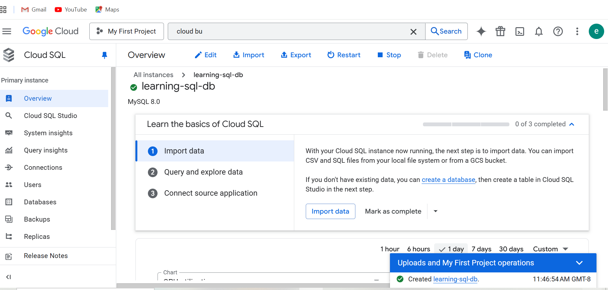
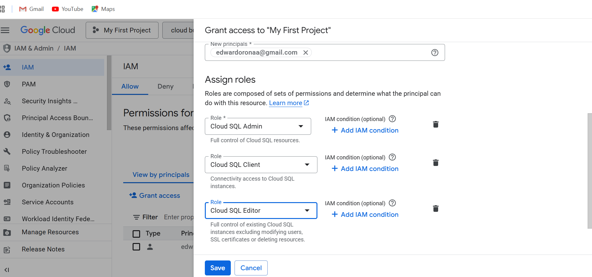
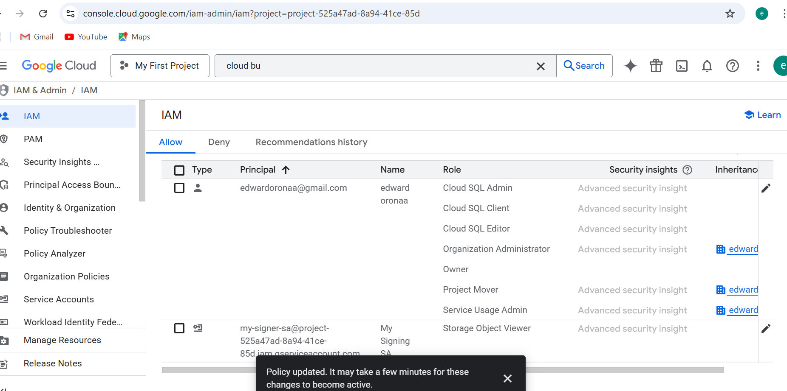
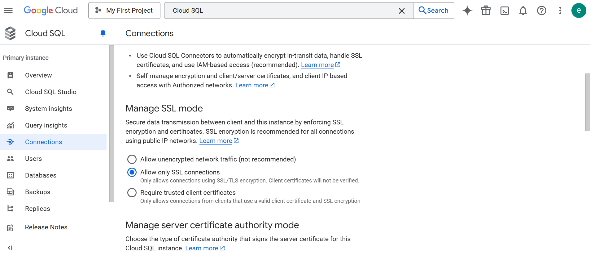
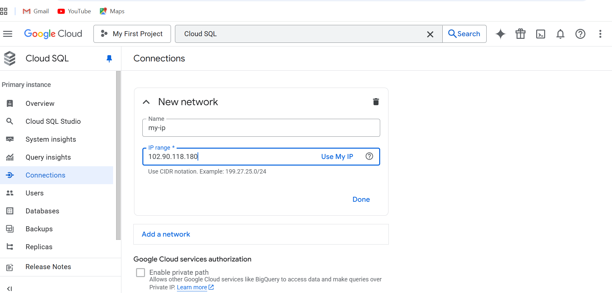
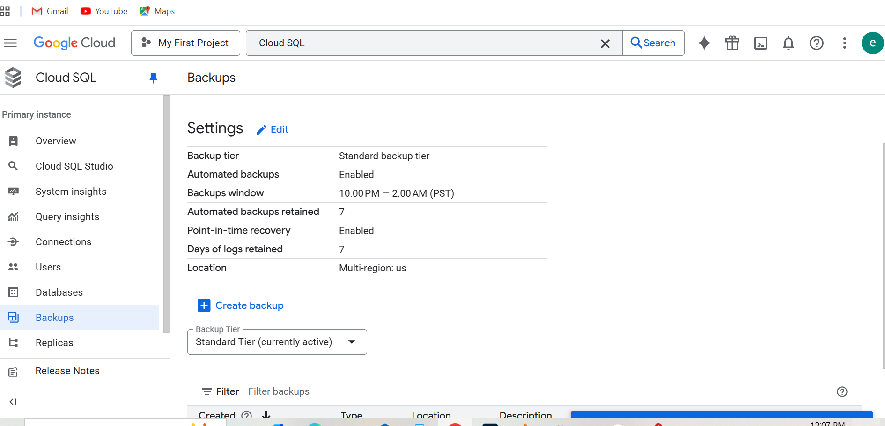
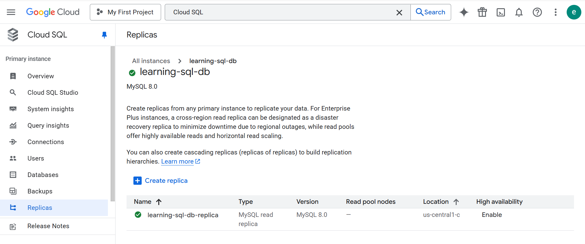
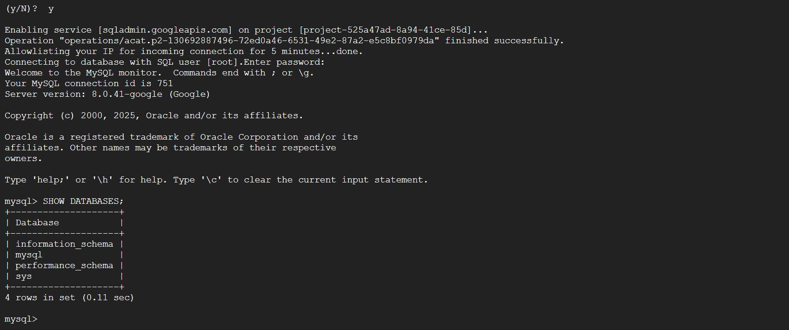
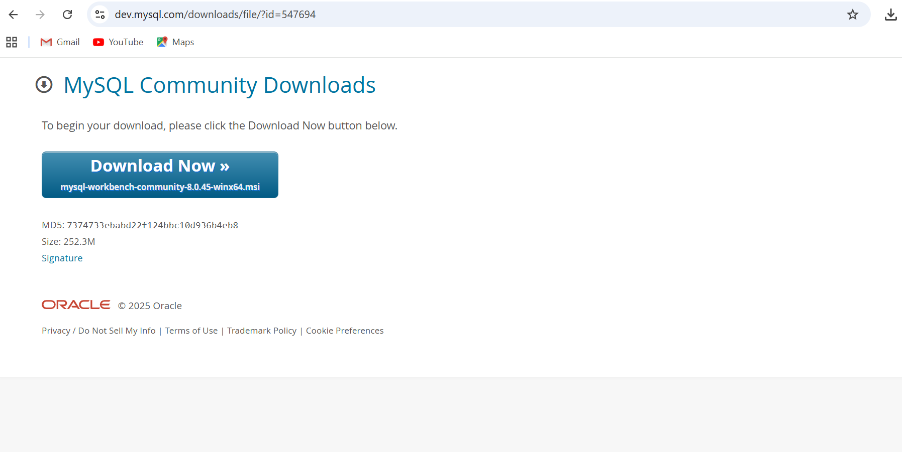

# Deploying and Managing a Database on GCP

## Objective
I set up and managed a relational database on Google Cloud SQL, applied security best practices, and enabled automated backups and scaling.

---

## 1. Create a Cloud SQL Instance
- I navigated to the GCP Console.
- I created a Cloud SQL instance using **MySQL**.
- I selected the appropriate machine type and storage based on project requirements.


### I added Screenshots


---

## 2. Configure Security and Access
- I set up IAM roles to control access to the Cloud SQL instance.
### I added Screenshots



- I enabled SSL/TLS encryption to secure connections.



- I restricted access using **VPC** and **authorized networks**.




---

## 3. Enable Backups and High Availability
- I enabled **automated daily backups**.
- I turned on **point‑in‑time recovery**.

### I added Screenshots


- I created a **read replica** to improve performance and support scaling.





---

## 4. Connect to the Database

### ✔ Using Cloud Shell  
I connected to my instance using:

```
gcloud sql connect learning-sql-db --user=root
```

### I added Screenshots


---

### ✔ Using MySQL Workbench  
- I Downloaded and installed and opened MySQL Workbench.

### I added Screenshots


- I added a new connection with:
  - Public IP of my instance  
  - Username: root  
  - Password: (the password I created)
- I successfully connected to my Cloud SQL database locally.


### I added Screenshots


---

## Completion
I completed all steps of deploying, securing, backing up, scaling, and connecting to my Cloud SQL database as part of this learning project.
