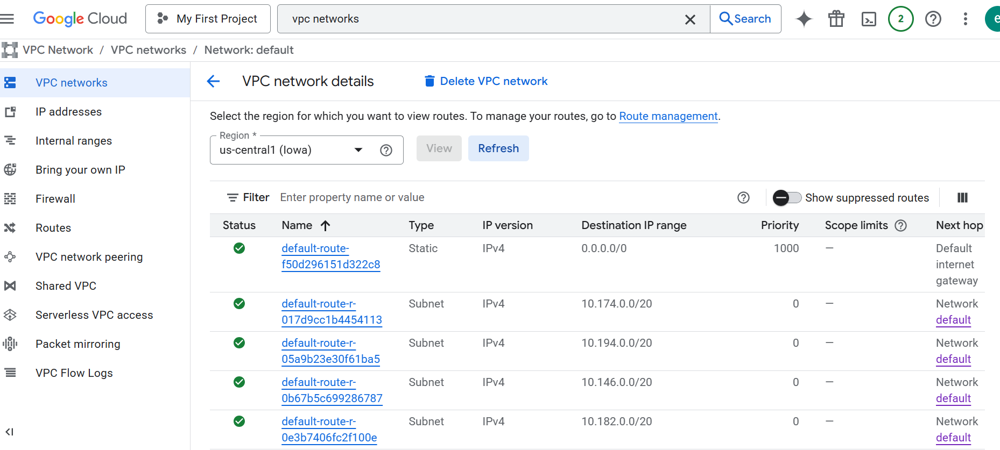
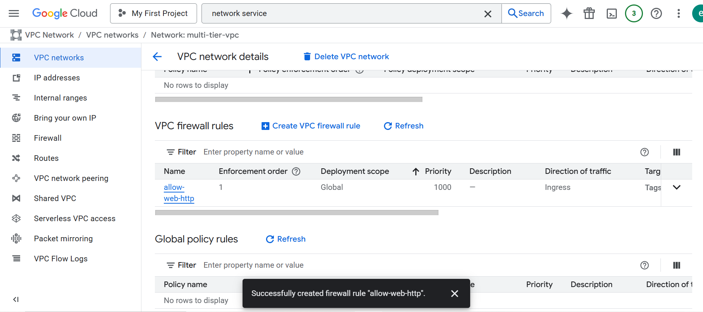
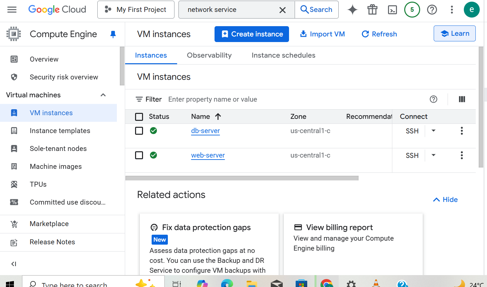
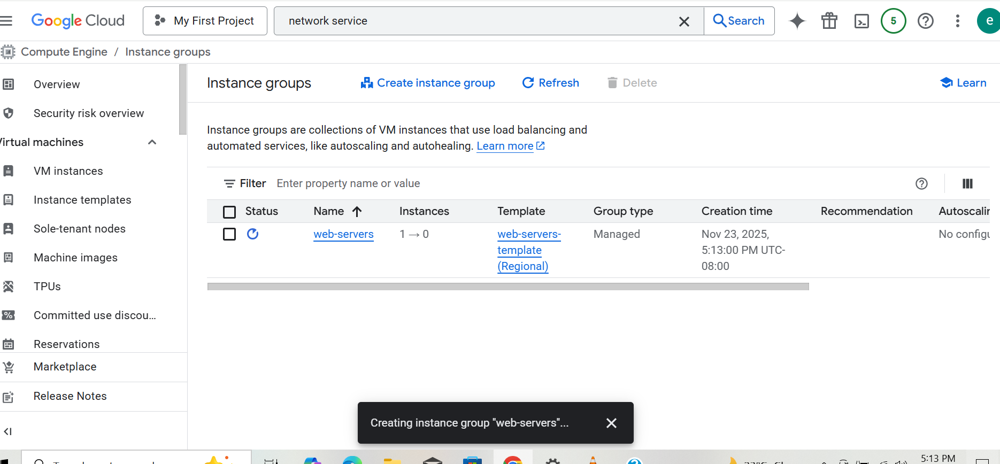
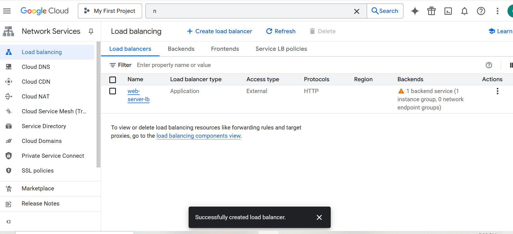
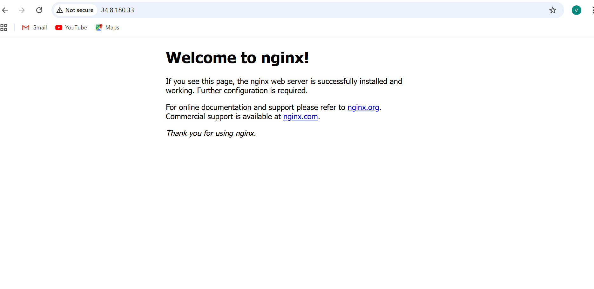

# Deploying a Secure Multi-Tier Network in GCP

## Project Overview

In this project, I designed and deployed a secure, scalable multi-tier network architecture in Google Cloud Platform (GCP). I used a custom VPC, public and private subnets, firewall rules, Cloud NAT, and an external HTTP Load Balancer. This setup allowed me to build a production-style environment with secure communication between layers.

## Project Goals

-   I created and configured a custom VPC with multiple subnets.\
-   I deployed public and private subnets for a web-and-database
    architecture.\
-   I implemented Cloud NAT for secure outbound internet access from
    private instances.\
-   I configured firewall rules to control access between subnets.\
-   I deployed an HTTP Load Balancer to distribute traffic across web
    servers.\
-   I tested connectivity and validated that my security controls worked
    as expected.

------------------------------------------------------------------------

## 1. Creating the Custom VPC and Subnets

I navigated to **VPC Network** in the GCP Console and created a
custom-mode VPC:

-   **VPC Name:** `multi-tier-vpc`\
-   **Subnet Mode:** Custom

I created two subnets:

### Web Subnet (Public)

-   **Name:** `web-subnet`\
-   **Region:** us-central1\
-   **CIDR Range:** `10.0.1.0/24`

### DB Subnet (Private)

-   **Name:** `db-subnet`\
-   **Region:** us-central1\
-   **CIDR Range:** `10.0.2.0/24`

------------------------------------------------------------------------

### I added screenshots

## 2. Configuring Internet Access for the Public Subnet

I confirmed the default route (`0.0.0.0/0`) was present to provide
internet access to the web subnet.

------------------------------------------------------------------------

### I added screenshots

## 3. Configuring Cloud NAT for the Private Subnet

I went to **VPC Network \> NAT Gateways** and created a Cloud NAT
configuration:

-   **Name:** `nat-db-subnet`\
-   **Region:** us-central1\
-   **VPC:** multi-tier-vpc\
-   **Subnets:** db-subnet

This allowed my private database instance to reach the internet securely
without exposing an external IP.

------------------------------------------------------------------------

### I added screenshots

## 4. Setting Up Firewall Rules

I created firewall rules under **VPC Network \> Firewall Rules**:

### Allow HTTP & HTTPS to Web Servers

-   **Name:** `allow-web-http`\
-   **VPC:** multi-tier-vpc\
-   **Target Tags:** `web-servers`\
-   **Source Ranges:** `0.0.0.0/0`\
-   **Ports:** tcp:80,443

These rules allowed public traffic into the web tier only.

------------------------------------------------------------------------

### I added screenshots

## 5. Deploying Web and Database VMs

I deployed two Compute Engine VMs:

### Web Server VM

-   **Name:** web-server\
-   **Subnet:** web-subnet\
-   **External IP:** Yes\
-   **Allowed HTTP/HTTPS:** Enabled

### Database Server VM

-   **Name:** db-server\
-   **Subnet:** db-subnet\
-   **External IP:** No

This ensured the database was isolated and only reachable internally.

------------------------------------------------------------------------

### I added screenshots

## 6. Configuring the Load Balancer

I navigated to **Network Services \> Load Balancing** and created an
**HTTP Load Balancer**.

### Backend Configuration

-   I created an Instance Group containing the web server.
-   I configured an HTTP health check.
-   I associated the Instance Group with my backend service
    (backend-web).

### Frontend Configuration

-   I assigned a new external IPv4 address.
-   I mapped incoming traffic on port 80 to the backend service.

Once deployed, I tested the Load Balancer using its external IP,
confirming I could reach my nginx web page.

------------------------------------------------------------------------

### I added screenshots

------------------------------------------------------------------------

## Final Outcome

By completing this project, I successfully deployed a secure and
production-style multi-tier network on GCP.\
I now understand how to configure VPCs, subnets, firewall rules, NAT
gateways, instance groups, and load balancers---core skills for cloud
networking and DevOps.
