# GCP Compute Project: Scalable and Secure Compute Infrastructure in Google Cloud

---

#### **Project Overview**
This project focuses on deploying a scalable, secure, and cost-efficient compute infrastructure using Google Compute Engine (GCE), Load Balancing, and Autoscaling. I also explored Google App Engine and Cloud Functions for serverless workloads.


---

#### **Project Goals**
- Set up a virtual machine with Google Compute Engine (GCE)
- Implement auto-scaling and load balancing for a web application
- Deploy a Python application on Google App Engine (GAE)
- Create an event-driven function using Google Cloud Functions
- Optimize compute costs using right-sizing and Spot VMs

---

### **Project Implementation Steps**

#### **1. Deploy a Compute Engine Virtual Machine**
I created a VM in GCP:
- **Name:** web-server-1
- **Region:** us-central1
- **Machine Type:** e2-medium
- **Boot Disk:** Ubuntu 22.04 LTS
- **Firewall:** Allow HTTP/HTTPS traffic


### I added Screenshots
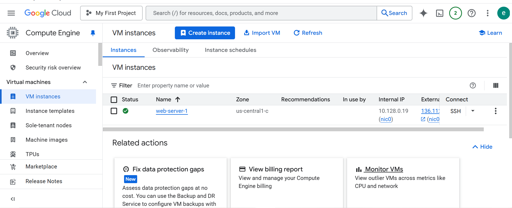

---

#### **2. Configure SSH Access and Security**
I creted and added my SSH key for secure access:
```bash
cat ~/.ssh/id_rsa.pub
```
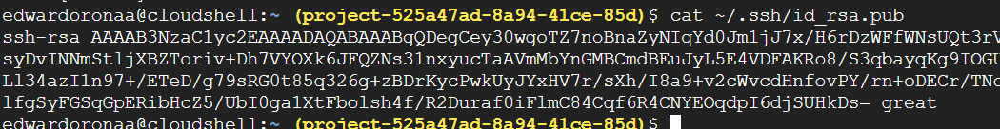

Added it under **Compute Engine > Metadata > SSH Keys**.


### I added Screenshots
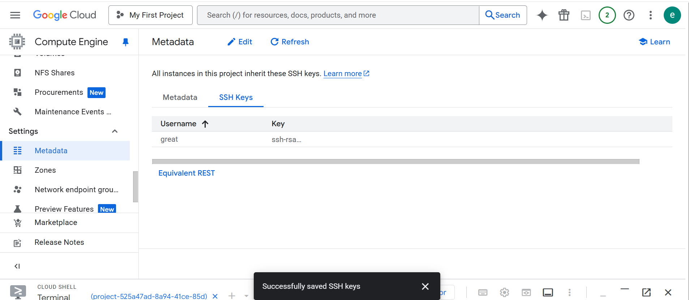

I Created a firewall rule to allow SSH access:
```bash
gcloud compute firewall-rules create allow-ssh --allow tcp:22 --source-ranges=YOUR_IP --target-tags=ssh-server
```
### Firewall Rule:

-   Name: allow-ssh\
-   Protocol: TCP:22\
-   Source: My IP


### I added Screenshots
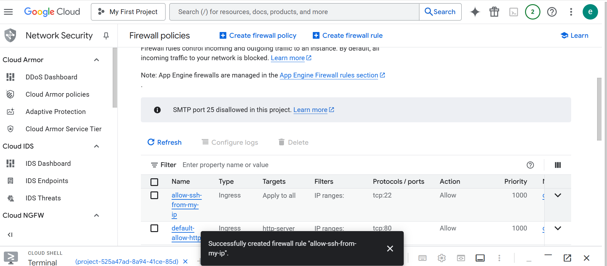

---

#### **3. Set Up Autoscaling and Load Balancing**
**Instance Template:**
- I Created an e2-micro instance template for cost efficiency.
- Allowed HTTP/HTTPS traffic.

### I added Screenshots
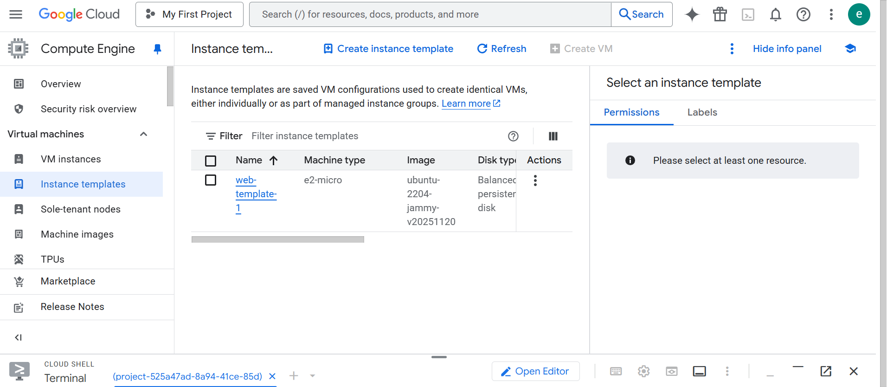

**Managed Instance Group:**
- Min instances: 2
- Max instances: 5
- Enabled autoscaling.

### I added Screenshots
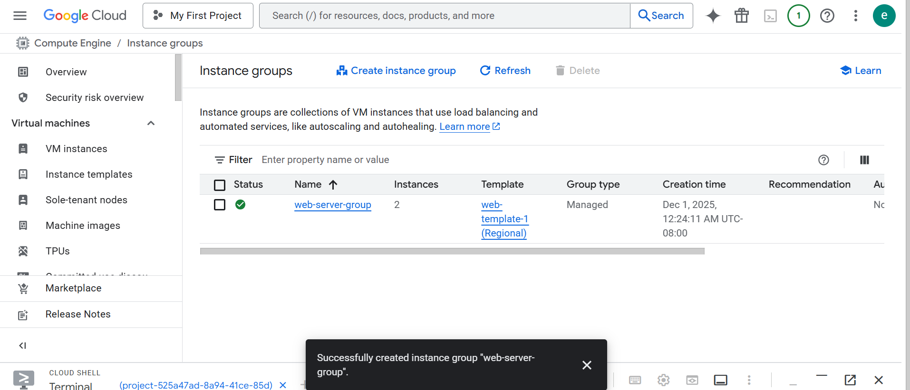

**Load Balancer:**
- I created a HTTP Load Balancer, configured with backend as the Instance Group.
- I also did Health checks configured.

### I added Screenshots
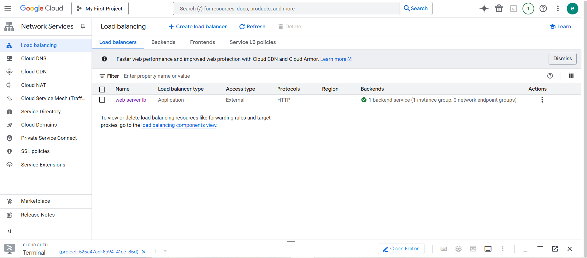

**Error encountered:** Initially, the health check failed because I did not open the correct firewall ports. Fixed by allowing HTTP traffic and directing the port to 22.


### I added Screenshots


---

#### **4. Create a Custom VM Image**
- Source: Existing VM disk
- Image name: web-server-image
- Storage location: Multi-region

Command:
```bash
gcloud compute images create web-server-image --source-disk=web-server-1 --source-disk-zone=us-central1-a --family=custom-images
```

### I added Screenshots
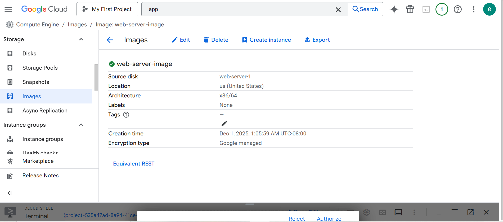

---

#### **5. Deploy a Python Web App on Google App Engine**
Created **app.yaml**:
```yaml
runtime: python311
instance_class: F2
automatic_scaling:
  min_instances: 1
  max_instances: 3
handlers:
  - url: /.*
    script: auto
```

Deployed app:
```bash
gcloud app deploy
gcloud app browse
```

### I added Screenshots
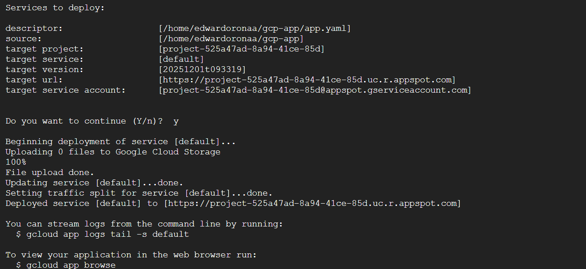


**Error encountered:** Deployment failed initially due to missing runtime directory structure. Fixed by ensuring `main.py` was present. also python39 and gen2 did not work, and i changed it to python311 and gen1. Hello GCP App Engine was the output.


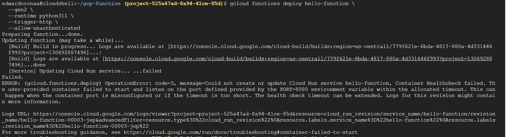
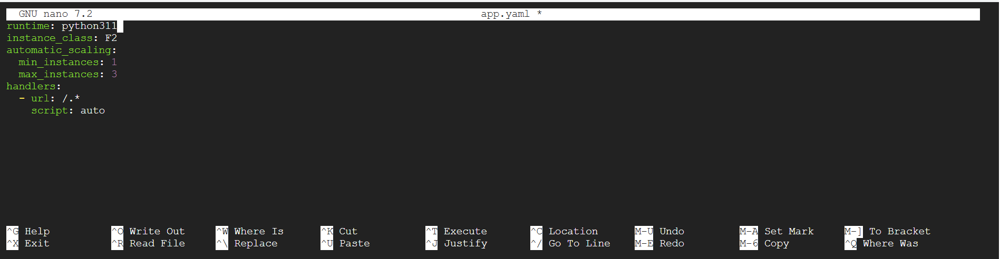


---

#### **6. Deploy a Serverless Cloud Function**
**Function code (main.py):**
```python
def hello_world(request):
    return "Hello, GCP Compute!", 200
```

Deployment:
```bash
gcloud functions deploy hello-function --runtime python39 --trigger-http --allow-unauthenticated
```

### I added Screenshots
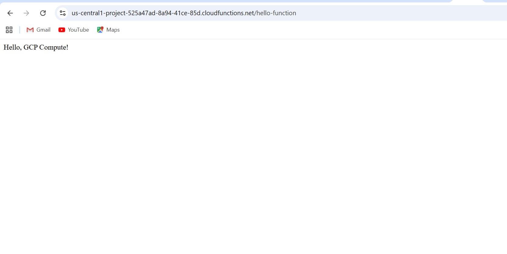


---

#### **7. Monitor and Optimize Compute Resources**
**CPU Utilization Alerts & Autoscaling Thresholds:**
- Set up in **Cloud Monitoring**.  
- Verified autoscaling thresholds matched target CPU utilization (60%).

### I added Screenshots
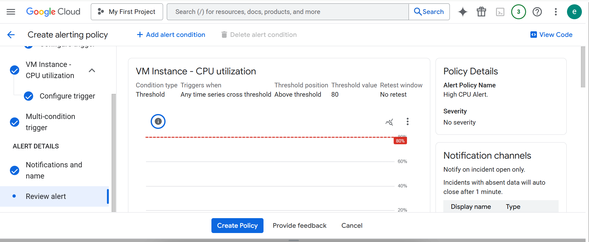

**Log-based Metrics for Security Events:**
- Created a counter metric for failed SSH login attempts:
```text
resource.type="gce_instance"
jsonPayload.event_type="failed_login"
```
- Alerts were configured to notify on threshold breach.

### I added Screenshots
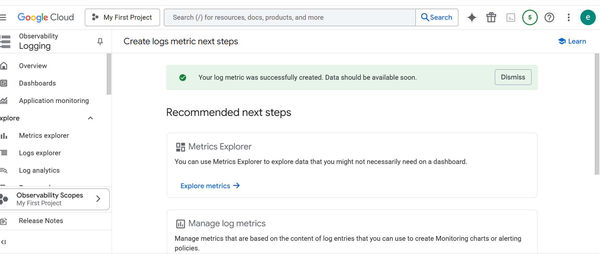
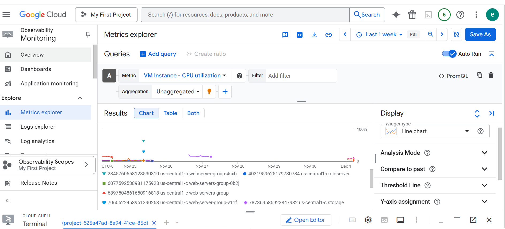


**Optimize Costs:**

##### **a) Using Spot VMs**
- I created a **Spot VM** named `spot-test-vm` for batch workloads.
- Verified it via SSH:
```bash
curl -H "Metadata-Flavor: Google" http://metadata.google.internal/computeMetadata/v1/instance/scheduling/preemptible
# Output: TRUE
```
- Installed Nginx to simulate workload:
```bash
sudo apt update
sudo apt install -y nginx
systemctl status nginx
```

### I added Screenshots
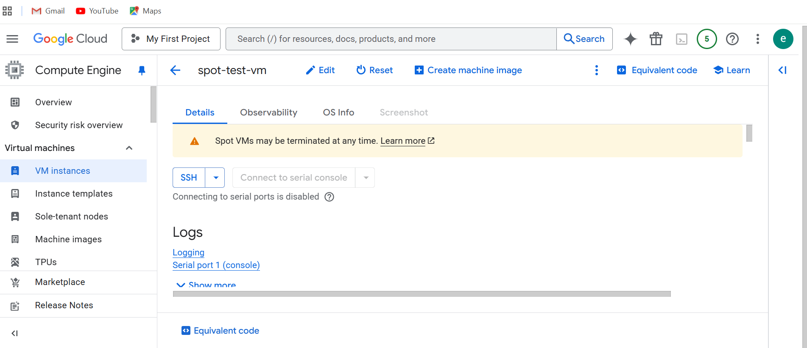


##### **b) Right-sizing VMs**
- Checked CPU/memory:
```bash
top -b -n1 | head -10
free -h
```
**Results:**
- CPU ~97% idle
- RAM ~30% used
- **Conclusion:** VM is over-provisioned; can downsize to smaller machine type (e.g., e2-micro) to reduce costs.

### I added Screenshots
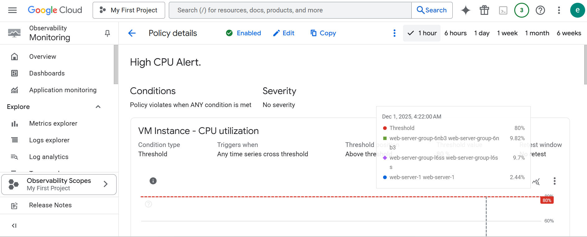

##### **c) Committed Use Discounts (CUDs)**
- My account uses free credits; actual CUDs cannot be purchased.
- I documented the process conceptually:
  1. Go to **Billing → Commitments**
  2. Click **Purchase Commitment**
  3. Select **Compute Engine**, choose **1- or 3-year term**, select vCPU & RAM
  4. Confirm purchase
- **Benefit:** Saves up to ~70% on standard VM costs for long-term workloads.
- CUDs complement Spot VMs and right-sizing for total cost optimization.

### I added Screenshots
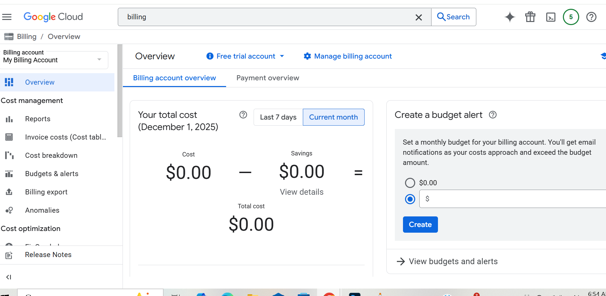
---

#### **Project Summary**
I successfully deployed a **scalable, secure compute infrastructure** on GCP:  
- Configured **VMs with SSH and firewall security**  
- Implemented **autoscaling and load balancing**  
- Created a **custom VM image**  
- Deployed a **Python app on App Engine**  
- Created a **serverless Cloud Function**  
- Set up **monitoring and log-based metrics**  
- Optimized costs using **Spot VMs, right-sizing, and CUDs (documented)**  


