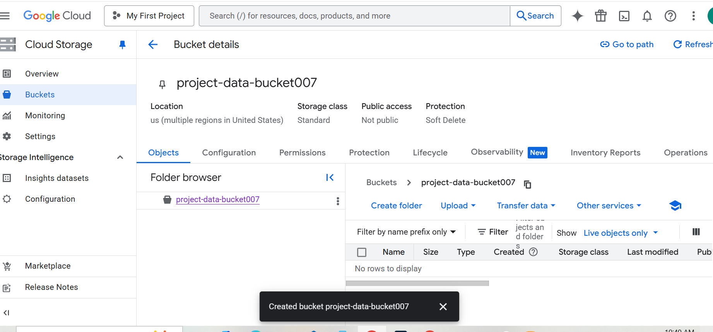
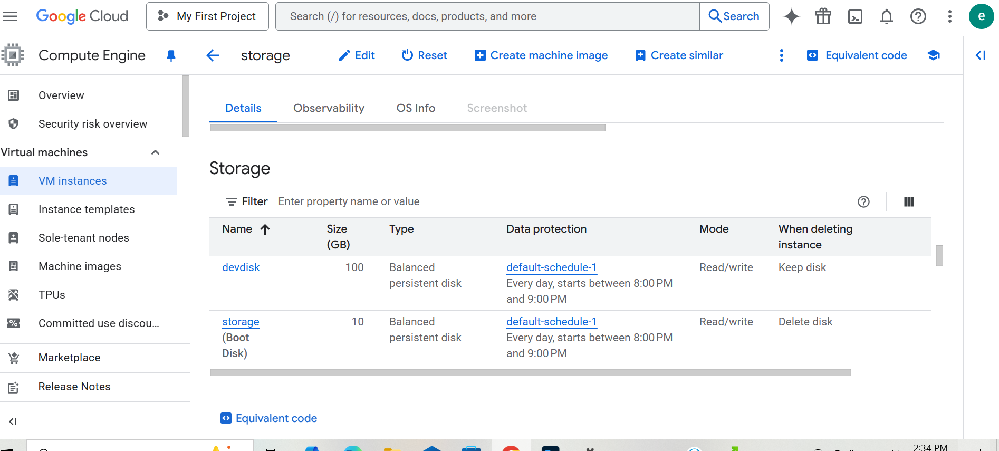
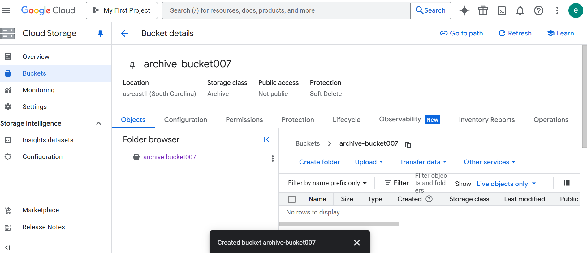
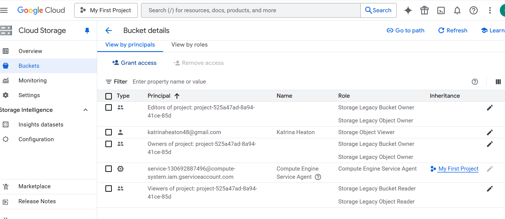
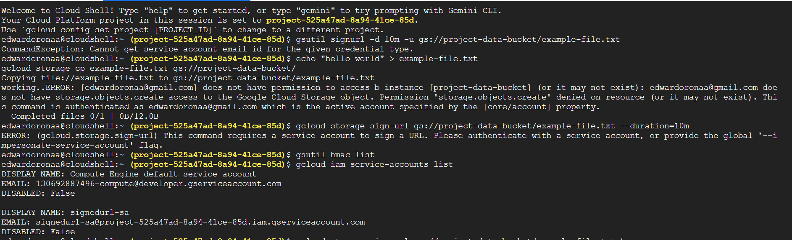
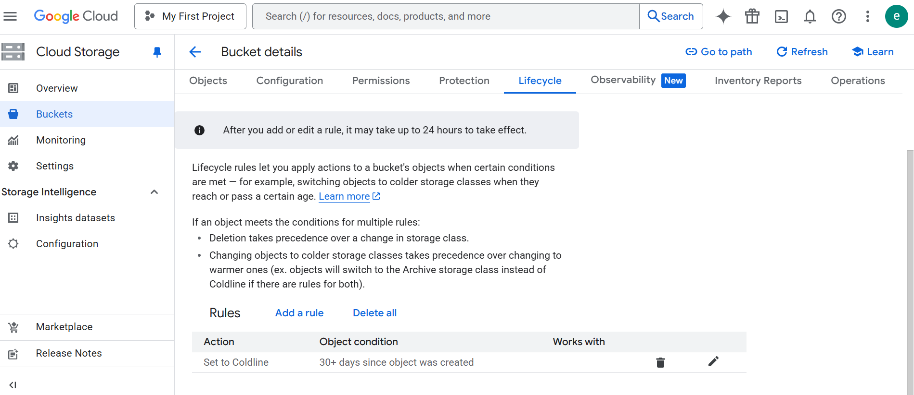
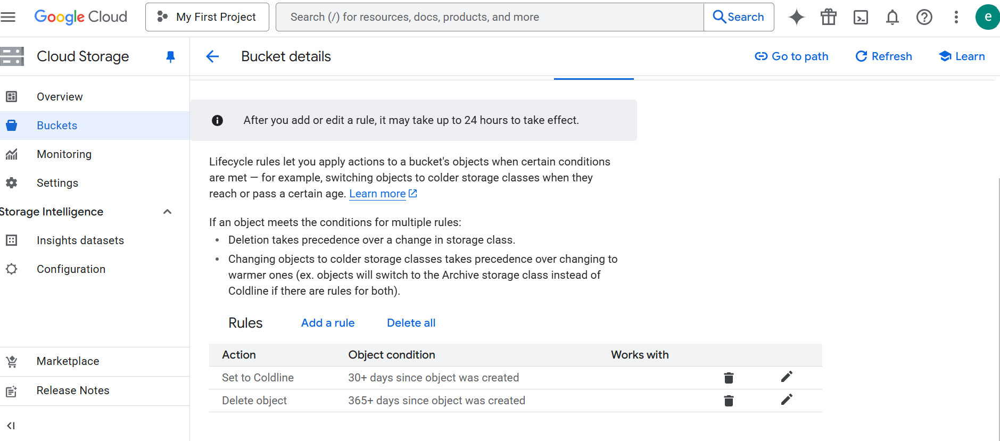
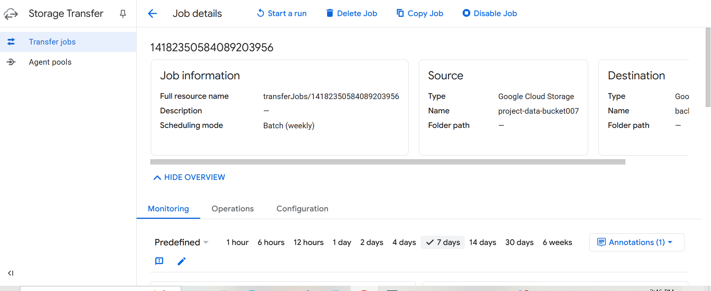

# GCP Storage Project: Secure and Scalable Data Storage with Google Cloud Storage & Persistent Disks

## Project Overview
In this project, I designed and deployed a secure, scalable, and cost-effective storage architecture in GCP using Google Cloud Storage (GCS) and Persistent Disks (PDs). The project covers:

- Creating and managing GCS buckets with different storage classes
- Implementing IAM-based access control and signed URLs
- Setting up Persistent Disks for Compute Engine instances
- Configuring lifecycle policies and backup strategies
- Performing data transfers and securing storage using encryption

## Project Goals
- Create and configure Google Cloud Storage buckets for different workloads
- Manage storage permissions and security using IAM and signed URLs
- Implement Persistent Disks (PDs) for block storage in Compute Engine
- Automate data backup and lifecycle policies
- Transfer data securely between different storage locations

## Project Steps

### 1. Create Google Cloud Storage Buckets
I navigated to **Cloud Storage → Buckets** in the GCP Console and created 3 different storage bucket.

- **project-data-bucket**
  - Location Type: Multi-Region (us)
  - Storage Class: Standard
  - Public Access: Block all public access

### I Added Screenshots

- **backup-bucket** (Coldline Storage for Backup)
  - Storage Class: Coldline
  - Location: us-central1

### I Added Screenshots

- **archive-bucket** (Archive Storage for Long-Term Storage)
  - Storage Class: Archive
  - Location: us-east1

### I Added Screenshots

---

### 2. Configure Bucket Permissions & Security
I configured permissions for `project-data-bucket`:
- Granted **Storage Object Viewer** access to `storage-user@example.com`
- Enabled **Uniform Bucket-Level Access** for simplified permission management

### I Added Screenshots

---

#### Signed URLs
I attempted to use signed URLs for temporary access, but **I could not generate them** due to the organization policy restricting service account key creation and impersonation. I documented the attempts and errors in screenshots.

### I added Screenshots

---

### 3. Configure Object Lifecycle Management
I configured lifecycle rules for `project-data-bucket`:
- Move objects to **Coldline storage** after 30 days

### I added Screenshots

- Delete objects older than 365 days

### I added Screenshots

---

### 4. Create and Attach Persistent Disks (PDs) to a VM
I navigated to **Compute Engine → Disks** and created:
- Name: `app-disk`
- Disk Type: Balanced Persistent Disk (`pd-balanced`)
- Size: 100GB
- Location: us-central1

---

### I added Screenshots

I attached the disk to an existing VM:
- Navigated to **Compute Engine → VM instances → Edit**
- Under **Additional Disks**, attached `app-disk`

---

### I added Screenshots

---

### 5. Backup and Snapshot Strategy for Persistent Disks
I created snapshots for `app-disk`:
- Snapshot Location: us-central1
- Snapshot Schedule: Daily
- Retention: 7 snapshots

---

### I Added Screenshots

---

### 6. Transfer Data Using Storage Transfer Service
I configured a transfer job:
- Source: `project-data-bucket`
- Destination: `backup-bucket`
- Schedule: Every Sunday at 02:00 AM UTC

### I added Screenshots

---

